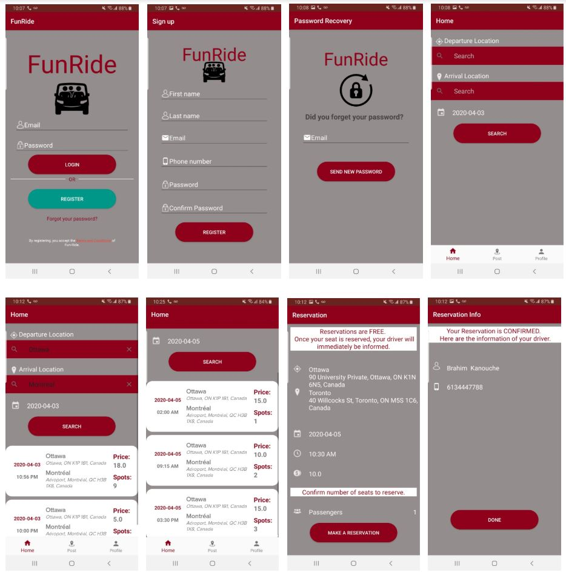
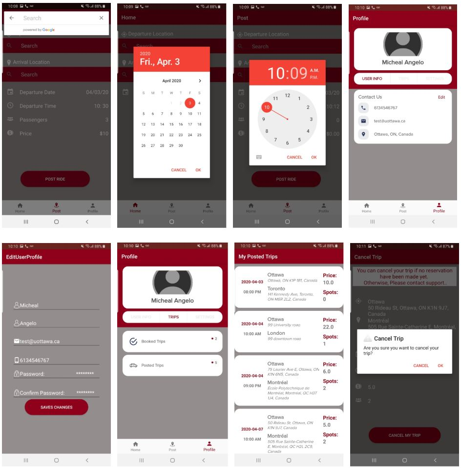
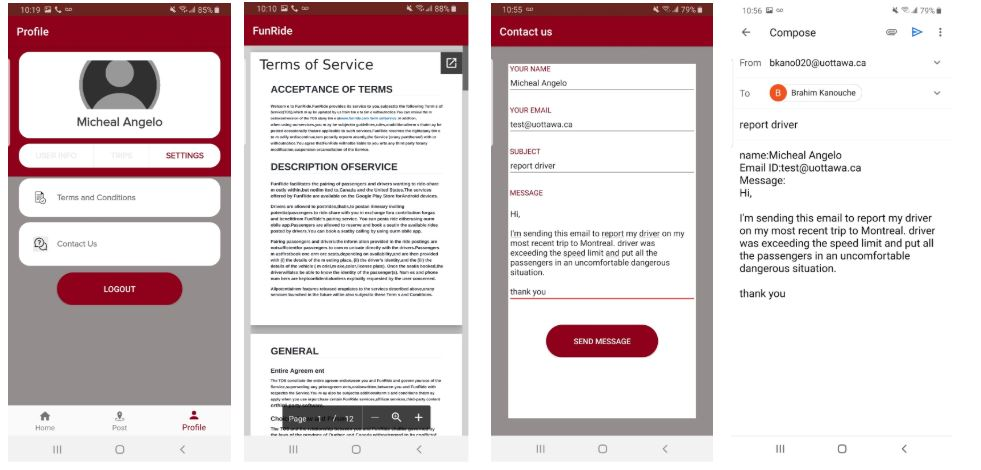

------------------------
# Android Apps
## I- FunRide - Android App
FunRide is a project for the SEG4910/4911 Capstone software engineering project course at the University of Ottawa. This project is under the supervision of Prof. Miguel Garzon and Prof.Stephane Some. FunRide is an 8-month project following the agile methodology where both the front-end and back-end will be built from scratch.

FunRide is a mobile application that will serve as a rideshare platform for traveling between cities in Canada. Ridesharing is a more economical option to travel from Point A to Point B in comparison to trains, busses, or flying. As a result, many people especially students are looking for advertisements in platforms like Kijiji or Craigslist to find these services.

The concern with using these applications is that it is not reliable for neither the driver nor passenger; safety is a problem as well. For example, there is nothing stopping drivers from going back on their word on what they posted in their advertisement, and there are no consequences to stop passengers from not showing up to a pickup location.

We created FunRide as a way for passengers to reserve rideshares without having to worry about these issues. Our goal is to provide a platform that emphasizes reliability, safety, and security.

For more information, take a look at the list of sections on our wiki https://github.com/kanouche/CapstoneBackEnd/wiki.

## Features
* Login as existing user
* Signup as a new user
* Password recovery
* Edit user profile
* Browse for rides. 
* Book a ride and secure your spot.
* Post a trip and get people to book available seats in your trip.
* See Historics of previous trips.
* Cancel a ride
* Cancel a posted trip
* Get Email notifications.
* Contact support

## Technologies used
* Java
* Kotlin
* Android Studio
* CircleCI for integration testing
* Github  
* Heroku using PostgreSQL and REST API.
* Espresso for Testing
* PlacesDetails API

### User Interface Screenshots

